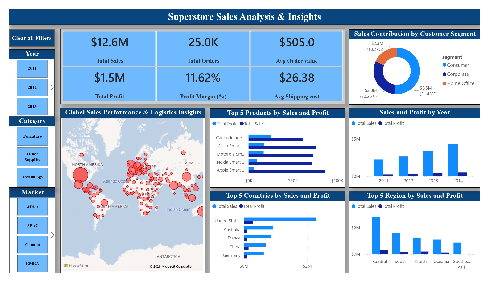

# Superstore Sales Analysis & Insights Dashboard

## Project Objective
An interactive Power BI dashboard designed to translate raw transactional retail data into strategic executive insights. The application focuses on identifying global revenue drivers, regional profitability disparities, top-performing products, and long-term macro-growth trends to facilitate data-driven operations.

## Interactive Dashboard Sneak Peek

---

## Key Business Insights (Data Storytelling)
* **Global Revenue Infrastructure:** The enterprise has secured a massive **$12.6M in Total Sales** across **25.0K Total Orders**, maintaining an overall healthy **Profit Margin of 11.62%** ($1.5M Total Profit) and an Average Order Value of $505.00.
* **The Core Profit Engine:** While the **Consumer** segment stands out as the dominant force driving market share (**51.48% of total revenue**, or $6.5M), the **Corporate** segment follows securely at 30.25% ($3.8M), leaving Home Office at 18.27% ($2.3M).
* **Inventory High-Performers:** Individual product deep-dives reveal that high-ticket items like the *Canon ImageCLASS Copier* and *Cisco Smart Phone* serve as critical flagship revenue and profit contributors.
* **Geographic Trends & Disparities:** The United States acts as the primary global revenue driver. On a macro-regional scale, the **Central** region heavily dominates overall sales volume, whereas markets like **Southeast Asia** operate on drastically narrower profit margins despite stable sales volumes.
* **Consistent Market Expansion:** Yearly historical timelines confirm a strong, upward trajectory in total revenue year-over-year from 2011 through 2014, demonstrating sustainable brand growth.

---

## Technical Architecture & Best Practices Applied
* **Visual Hierarchy Layout:** High-level executive KPI cards are positioned prominently at the top-left, flowing intuitively down to global logistics map visualizations and granular top-performing item ranks.
* **Harmonized Color Palette:** Implemented a unified corporate dark blue and sky blue color scheme to minimize visual noise, eliminate layout clutter, and ensure readable color-coded performance indicators.
* **Optimized Dynamic Interactivity:** Built structured tile slicers for **Year**, **Category**, and **Market** alongside a custom-configured **"Clear all Filters"** action button to provide a frictionless end-user exploration experience.

---

## Technical Interview Framework (Task Q&A)

### 1. What is the importance of data visualization?
Data visualization bridges the gap between raw, complex tabular data and human decision-making. By translating millions of rows of data into structured graphical forms, it allows stakeholders to spot hidden operational trends, outliers, anomalies, and regional correlations instantly, accelerating corporate strategy.

### 2. When do you use a pie chart vs. a bar chart?
* **Pie/Donut Charts:** Use exclusively when comparing a tiny number of components (ideally 2 to 4) that together make up a definitive 100% part-to-whole relationship (e.g., Customer Segment market share).
* **Bar Charts:** Use when comparing 5 or more categories, or when category labels are long (e.g., specific Product Names or Countries). Horizontal bars prevent text clipping, keep names scannable from left to right, and make ranking intuitive.

### 3. How do you make visualizations more engaging?
Engagement is achieved through structural restraint and interactivity. This includes removing non-essential gridlines (decluttering), choosing a deliberate corporate color palette rather than a rainbow of colors, maintaining exact grid alignment, and adding dynamic features like cross-filtering slicers and reset buttons so users can direct their own data exploration.

### 4. What is data storytelling?
Data storytelling is the practice of wrapping raw data metrics inside a meaningful business narrative. It goes beyond explaining *what* the visual is showing (e.g., "This is a sales bar chart") and instead explains *why* the metric matters to the business, what the root cause is, and what strategic actions executive leadership should take based on those insights.

### 5. How do you avoid misleading visualizations?
* Always start the quantitative axes (Y-axis/X-axis) at a baseline of zero to prevent artificial scale exaggeration.
* Use honest chart sizes that accurately reflect proportional changes in data values.
* Ensure data labels match the true underlying numbers explicitly without distorting scales.
* Avoid 3D charts, which distort perspective and make accurate visual reading difficult.

### 6. What are best practices in dashboard design?
* **Form Follows Function:** Place the most critical, high-level numbers (KPIs) at the top-left where the human eye naturally scans first.
* **Consistency:** Maintain uniform fonts, border styles, container shadows, and structural alignment (using "Snap to Grid").
* **Spacing:** Leave intentional blank space (whitespace) between components so the layout doesn't feel overwhelming.

### 7. What tools have you used for visualization?
I have leveraged **Power BI Desktop** along with **DAX (Data Analysis Expressions)** to engineer custom calculating metrics (`Total Sales`, `Total Profit`, and `Profit Margin %`). Additionally, I utilize relational databases like **MySQL** for data querying and visualization tool integrations.
